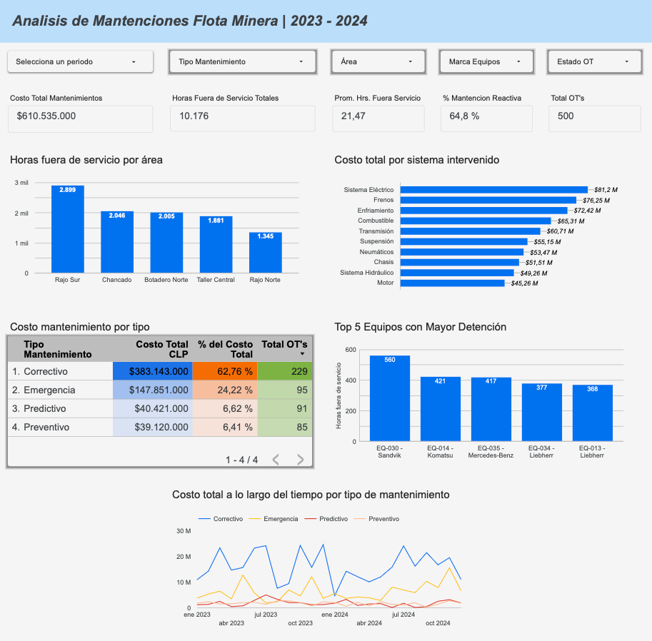

# Análisis de Mantenciones de Flota Minera (2023 - 2024)

[](https://www.python.org/)
[](https://pandas.pydata.org/)
[](https://cloud.google.com/bigquery)
[](https://lookerstudio.google.com/)

---

## Descripción General
Proyecto end-to-end de análisis de datos enfocado en la disponibilidad, confiabilidad y costos operacionales de una flota minera (40 equipos) entre 2023 y 2024. 

El proyecto abarca desde la ingesta y auditoría de calidad de datos crudos (`raw.xlsx`), un pipeline **ETL en Python (Pandas)** para limpieza y normalización, modelado y consultas analíticas en **SQL**, hasta la visualización ejecutiva en un **Dashboard interactivo en Looker Studio**.
NOTA IMPORTANTE: SE ANONIMIZO EL DATASET ORIGINAL POR MOTIVOS DE PRIVACIDAD DEL CLIENTE DE IGUAL MANERA SE MODIFICARON FECHAS.
---

## Dashboard Ejecutivo (Looker Studio)



### KPIs y Métricas Principales del Periodo:
* **Gasto Total en Mantenciones:** $610.535.000 CLP
* **Horas Fuera de Servicio Totales:** 10.176 hrs
* **Promedio de Detención por OT:** 21,47 hrs
* **Tasa de Mantención Reactiva (Correctivo + Emergencia):** 64,8%
* **Órdenes de Trabajo Validadas:** 500 OTs

---

## Stack Tecnológico
* **Lenguaje:** Python
* **Procesamiento y ETL:** Pandas, NumPy, OpenPyXL
* **Almacenamiento y Consultas:** Google BigQuery / SQL (DWH)
* **Visualización & BI:** Looker Studio
* **Control de Versiones:** Git & GitHub

---

## Estructura del Repositorio

```text
Caso_02_Flota_Minera/
├── data/
│   ├── duplicados_ots.csv       # Registro histórico de OTs duplicadas extraídas
│   └── raw.xlsx                 # Dataset crudo con hojas 'Ordenes' y 'Equipos'
├── imgs_proyecto/
│   └── InformeLookerStudio.png  # Captura visual del reporte de BI
├── SQL/
│   └── consultas.sql            # Queries analíticas y agregaciones clave
├── src/
│   └── etl_flota.py             # Script de extracción, transformación y carga
└── README.md                    # Documentación del proyecto
